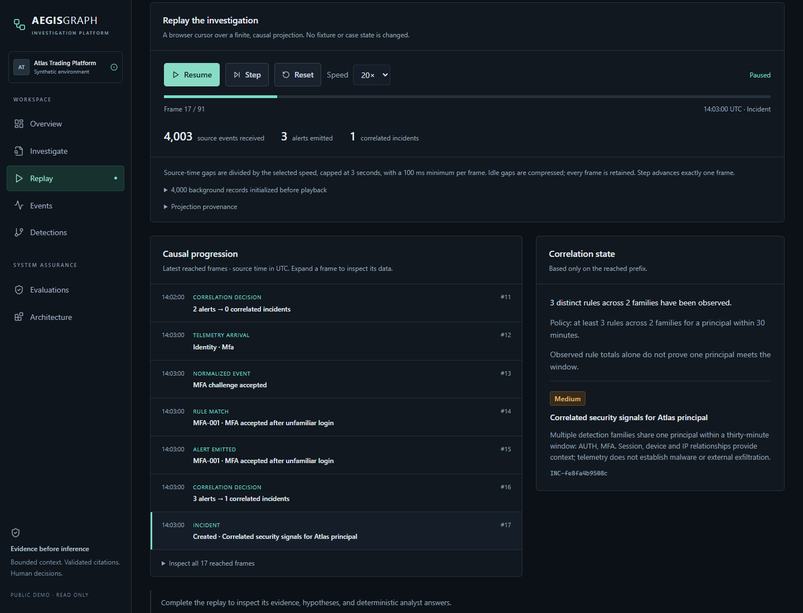
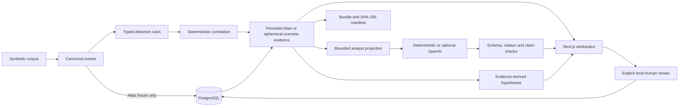

# AegisGraph

**Evidence-grounded security investigation for a simulated fintech environment.**

[Live demo](https://aegisgraph.farhan-shafee.com) · [Architecture](docs/architecture/SYSTEM.md) · [Threat model](docs/threat-model/THREAT_MODEL.md) · [Evaluations](docs/evaluations/BENCHMARK.md)

[Detection replay](docs/REPLAY.md) · [Seven-minute walkthrough](docs/DEMO.md) · [Engineering notes](docs/INTERVIEW_NOTES.md) · [Code guide](docs/README.md)



AegisGraph connects deterministic detections and correlation to an evidence
workspace, a bounded AI analyst, and explicit human review. Eight synthetic
scenarios let a reviewer replay observations, inspect competing explanations,
compare a rule change, and verify an exported investigation. FastAPI, Next.js,
and PostgreSQL support the same workflow without requiring an OpenAI key.

## What it demonstrates

- Causal replay: alerts and incident state appear only when their supporting
  observations have arrived.
- Evidence inspection: source records, a timeline, relational entity links,
  cited findings, and hypotheses with supporting and contradicting evidence.
- Detection engineering: bounded parameter proposals, immutable revisions,
  full-corpus comparisons, and explicit PASS / WARN / BLOCK review gates.
- AI boundaries: structured claims, independently checked citations and support
  predicates, and insufficient-evidence behavior.
- Portable review: a scoped JSON evidence bundle and browser/CLI SHA-256
  verification against its supplied manifest.

The bundled telemetry is synthetic. Local mode supports saved reviews and optional
OpenAI analysis. Public mode is read-only, uses deterministic analysis, and incurs
no OpenAI spend. See [deployment and verification](docs/DEPLOYMENT.md) for the
hosted revision; these documents describe the current repository.

## Demo scenario

The canonical Atlas case follows unfamiliar authentication, MFA acceptance, a
privileged role grant, internal endpoint requests, sensitive account access,
unusual volume, a second session, and role reversion. Its original **4,026 events,
10 alerts, and 26 evidence items** remain intact. These are reproducible fixture
counts, not effectiveness or throughput metrics.

The [eight-scenario corpus](packages/synthetic-data/README.md) adds authentication
pressure, service-principal access, sensitive resource exploration, approved
administration, scheduled reconciliation, an isolated unfamiliar sign-in, and
conflicting account context. Independent labels stay separate from runtime
analyst input. A scenario that does not meet the correlation policy remains an
observation scope; the application does not invent an incident for it.

## Architecture



The hosted path is **browser → Vercel Next.js → Railway FastAPI → Railway
PostgreSQL**. One API and one relational database serve the application; entity
relationships do not require a graph database. SQLite supports disposable local
demos and tests. Public mode disables persistent analyst writes. The
[system design](docs/architecture/SYSTEM.md) explains the data model, replay,
deployment, and trust boundaries.

Atlas is the persisted canonical case. The other corpus projections stay
ephemeral, including scenarios that produce a correlated incident during replay.

## Detection and correlation

[Ten rule definitions](packages/detections/rules.json) describe inspectable
authentication, privilege, API, and data-access policies. The
[detector](apps/api/aegisgraph/detection.py) emits source-cited alerts.
[Correlation](apps/api/aegisgraph/correlation.py) groups one principal's alerts
within 30 minutes of the first alert, requiring three distinct rules across two
families. Device, session, and IP links provide investigation context.

The [workbench](docs/DETECTION_WORKBENCH.md) exposes typed thresholds/windows;
there is no code editor. For APP-002, changing 1,000 to 1,500 records removes the
benign reconciliation signal while retaining the required service and Atlas
volume signals. The computed gate passes on these fixtures. A 2,200-record
proposal loses a required signal and is blocked. These are synthetic tradeoffs,
not measured production precision or recall.

Approved local revisions affect future replay projections. Historical alerts and
the canonical Atlas investigation are preserved. Public visitors can inspect
three fixed comparisons without saving or approving changes.

## Evidence-grounded AI and hypotheses

The [analyst boundary](apps/api/aegisgraph/analyst.py) checks case scope and projects
bounded, allowlisted evidence. Providers receive no database handle, retrieval
tools, or mutation authority. They propose typed claims and evidence IDs; the
application checks schema, exact context membership, and claim-support predicates
outside the model. One invalid claim rejects the proposed answer. Server templates
render accepted statements, rather than arbitrary model prose.

The separate [hypothesis ledger](docs/HYPOTHESES.md) shows evidence-derived status,
supporting and contradicting citations, and “What would confirm or reject this?”
guidance. Human acceptance is recorded separately and does not turn partial
support into confirmation. Context changes make old reviews stale.

Grounding means consistency with supplied observations. It does not prove source
truth, complete coverage, or who operated an account. The question guard and
claim vocabulary are deliberately narrow; confidence is qualitative.

## Security boundaries

- **Access:** local analyst labels are not authenticated identities. Public mode
  denies persistent writes and restricts analysis to two curated deterministic
  questions. Authenticated case permissions and tenant isolation are future work.
- **Untrusted input:** raw prose and unnecessary metadata are excluded from model
  context. Tested prompt-like telemetry remains data; this is not a universal
  prompt-injection resistance claim.
- **Human decisions:** the provider cannot edit cases, save findings, approve
  hypotheses, or approve reports. Relevant case changes invalidate report approval.
- **Integrity:** migrated database triggers reject ordinary event/audit edits.
  Bundle hashes detect changes against an unsigned, replaceable manifest; they
  do not establish authenticity, source truth, or privileged-owner resistance.

Read the [threat model](docs/threat-model/THREAT_MODEL.md),
[bundle boundary](docs/EVIDENCE_BUNDLES.md), and [security policy](SECURITY.md).

## Evaluation

The [V2 analyst benchmark](docs/evaluations/BENCHMARK.md) executes named synthetic
obligations for claim support, citations, false premises, case isolation,
untrusted context, malformed output, and counterevidence. Results show expected
versus actual behavior and explicit metric denominators. Rule regressions
separately measure complete before/after rulesets across the corpus.

The original deterministic suite and its stored history remain separate. The
[September 2026 live OpenAI record](docs/evaluations/LIVE_VALIDATION.md) separately
documents grounded investigation, structured validation, insufficient evidence
for a malware premise, and exclusion of tested malicious telemetry. It preserves
availability failures and does not establish general model safety. New
deterministic benchmark results are not additional live-model trials.

Consult [current validation](docs/VALIDATION.md) for executed counts, CI status,
and limitations. Public CI and the ordinary demo need no OpenAI credentials.

## Tech stack

| Layer        | Technologies                                                        |
| ------------ | ------------------------------------------------------------------- |
| Web          | Next.js App Router, React, TypeScript, Tailwind CSS                 |
| API          | Python, FastAPI, Pydantic, HTTPX                                    |
| Persistence  | PostgreSQL, SQLAlchemy, Alembic; SQLite for local demos/tests       |
| Analyst      | Deterministic provider; optional OpenAI Responses API               |
| Verification | pytest, Ruff, Vitest, Testing Library, Playwright, ESLint, Prettier |
| Delivery     | GitHub Actions, locked dependencies, Vercel, Railway                |

## Quick start

Use **Python 3.12+ and Node.js 24+**, from the repository root. The disposable
SQLite demo needs no external service or API key.

```sh
python -m venv .venv
# macOS/Linux; PowerShell: .\.venv\Scripts\Activate.ps1
source .venv/bin/activate
python -m pip install -r requirements.lock
python -m pip install -e . --no-deps
npm ci --prefix apps/web
python -m aegisgraph.cli demo-reset
python -m aegisgraph.cli demo-api
```

In another terminal, run `npm run dev --prefix apps/web` and open
[localhost:3000](http://127.0.0.1:3000). `demo-reset` deletes disposable edits and
runs in the reserved demo database; stop its API before resetting. `demo-api`
explicitly selects the deterministic provider unless live mode is requested.
See [setup and PostgreSQL instructions](docs/SETUP.md).

## Demo walkthrough

Follow the [seven-minute script](docs/DEMO.md): replay Atlas at 20×, inspect the
canonical evidence graph, ask the two analyst questions, inspect a hypothesis,
compare an APP-002 change, inspect evaluation obligations, and export/verify the
case. The [screenshot guide](docs/screenshots/README.md) and
[interview notes](docs/INTERVIEW_NOTES.md) provide supporting material.

## Testing

The [CI workflow](.github/workflows/ci.yml) separates backend/database validation,
frontend checks/build, and local/public browser workflows. Deterministic suites,
dependency audits, and database migration checks are documented in
[setup](docs/SETUP.md#testing). Run results belong in the dated
[validation record](docs/VALIDATION.md) and
[GitHub Actions](https://github.com/farhan-shafee/aegisgraph/actions/workflows/ci.yml).

## Threat model and decisions

The [five-minute code guide](docs/README.md) links the architecture, threat model,
ADRs, detection/correlation code, analyst validator, independent fixtures,
workbench, hypothesis review, and export verifier.

## Implemented versus future work

Implemented: the synthetic corpus, bounded causal replay, evidence and entity
inspection, typed rule revisions with regression gates, hypothesis review,
validated analyst claims, report review/invalidation, deterministic evaluations,
and hash-verifiable exports. The public deployment uses a read-only projection;
saved analyst and rule-review actions belong to local mode.

Production work remains: authenticated users and case permissions, tenant
isolation, authenticated streaming ingestion and reprocessing, multi-instance
rule rollout, least-privilege database roles, independent evidence/audit retention,
backup/recovery, provider privacy review, and repeated live-model evaluation.
Scaling choices require measured workloads. No autonomous response or production
security certification is claimed.

## License

Licensed under the [MIT License](LICENSE).
