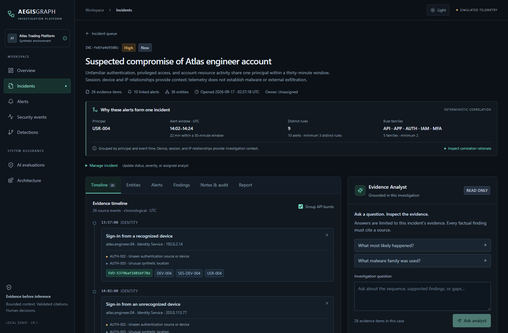
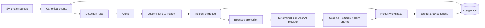

# AegisGraph

**Evidence-grounded security investigation for a simulated fintech environment.**



AegisGraph turns synthetic identity, API, endpoint, and application telemetry into
an inspectable investigation. FastAPI and PostgreSQL hold the evidence; Next.js
provides the analyst workspace. An optional OpenAI provider proposes typed claims
that the application validates against case evidence before displaying them.

[Architecture](docs/architecture/SYSTEM.md) ·
[Seven-minute demo](docs/DEMO.md) ·
[Code and documentation guide](docs/README.md) ·
[Public release review](docs/PUBLIC_RELEASE_REVIEW.md)

## What it demonstrates

- A reproducible path from four source adapters to canonical events, rule alerts,
  and deterministic incident correlation.
- Investigation through a chronological timeline, entity graph, source-event
  inspection, separate annotations, and cited findings.
- Bounded AI context, structured output, external citation and claim validation,
  and explicit insufficient-evidence behavior.
- Human review: findings and template reports require separate approval actions;
  case changes invalidate report approval and record an audit event.
- Credential-free local operation, deterministic fixtures, and separately
  recorded live-provider results.

All application data is synthetic. This is a local engineering demonstration,
with no real banking integration or production authentication.

## Demo scenario

A fictional Atlas engineer account moves from recognized-device activity to an
unfamiliar login, MFA acceptance, a privileged role grant, endpoint enumeration,
sensitive account access, unusual data volume, a second session, and rapid role
reversion.

The default seed produces **4,026 events, 10 alerts, and one incident with 26
evidence items**. These are reproducible fixture counts, not detection-quality or
performance metrics. The sequence supports investigation of possible account
misuse; it does not establish malware, exfiltration, or the person behind it.

## Architecture



One API and one relational database serve the investigation. The entity graph is
derived from event/entity associations. SQLite supports lightweight demos and
isolated tests; PostgreSQL is the primary database. See the
[system design and trust boundaries](docs/architecture/SYSTEM.md).

## Detection and correlation

The [ten JSON rules](packages/detections/rules.json) describe authentication,
privilege, API, and sensitive-access signals. The
[detection engine](apps/api/aegisgraph/detection.py) emits alerts with source-event
references. These rules are synthetic policy examples, not calibrated detectors.

[Correlation](apps/api/aegisgraph/correlation.py) groups alerts for one principal
within 30 minutes of the first alert, requiring at least three distinct rules
across two families. Session, device, and IP links provide investigation context.
The primary incident has ten alerts from nine distinct rules across five families
over 22 minutes. Baseline observations and alert-cited events remain available to
explain the sequence. Detection and correlation can be reviewed and tested
independently.

## Evidence-grounded AI

The API retrieves up to 50 current-case evidence rows in event-time order. The
[analyst boundary](apps/api/aegisgraph/analyst.py) validates scope, projects
allowlisted fields, excludes analyst-marked benign observations, and enforces
context limits. Providers receive no database session, retrieval tools, or
mutation functions.

The provider selects typed claims and evidence IDs. The
[claim validator](apps/api/aegisgraph/analyst.py#L692) checks the schema, exact
context membership, and deterministic support predicates outside
the model. One invalid claim rejects the whole proposed answer. Server templates
render accepted findings and their summary; arbitrary model-written prose cannot
bypass these checks. The deterministic and OpenAI providers use the same boundary.

The narrow claim vocabulary is intentional. Grounding means consistency with
supplied telemetry, not proof that the telemetry is true or the answer complete.
The confidence label is qualitative, not a measured probability. See the
[evaluation methodology and limits](docs/evaluations/README.md).

## Security boundaries

- **Local access:** the demo uses a fixed analyst label and loopback restrictions.
  Case scoping is implemented; authenticated user and tenant authorization are not.
- **Untrusted telemetry:** raw text and unnecessary metadata are excluded from
  model context. Tested prompt-like fields remain data, not instructions.
- **Evidence integrity:** migrated PostgreSQL/SQLite triggers reject ordinary
  event and audit updates/deletes. A database owner can bypass these controls;
  they are not cryptographic tamper-proof storage.
- **Human decisions:** the model cannot edit incidents, save findings, or approve
  reports. Human-authored findings still require human judgment.

Read the [threat model](docs/threat-model/THREAT_MODEL.md) and
[security reporting policy](SECURITY.md). Keep the demo local.

## Evaluation

[Synthetic fixtures](tests/fixtures/ai_cases.json) exercise grounding, false
premises, prompt-like telemetry, cross-case input, invalid citations, malformed
output, context limits, and mutation attempts. The evaluation UI displays results
from executed runs and labels deterministic and live results separately. Passing
fixtures does not establish general model safety or production readiness.

The recorded **2026-09-17 live validation** passed three named scenarios over six
harness requests: grounded investigation, a malware question returning insufficient
evidence, and malicious telemetry excluded by projection. Three earlier HTTP 429
failures remain recorded. Five local boundary checks and two additional live
browser confirmations are counted separately. The injection fixture does not show
a model resisting instructions it never received. See the
[complete live record](docs/evaluations/LIVE_VALIDATION.md).

Current test counts and executed outcomes are in the
[validation record](docs/VALIDATION.md) and
[public release review](docs/PUBLIC_RELEASE_REVIEW.md). Public CI requires no
OpenAI credentials or live calls.

## Tech stack

| Layer | Technologies |
|---|---|
| Web | Next.js App Router, React, TypeScript, Tailwind CSS |
| API | Python, FastAPI, Pydantic, HTTPX |
| Persistence | PostgreSQL, SQLAlchemy, Alembic; SQLite for demos/tests |
| AI | Deterministic provider; optional OpenAI Responses API with structured output |
| Verification | pytest, Ruff, Vitest, Testing Library, Playwright, ESLint, Prettier |
| Delivery | GitHub Actions, dependency lockfiles, Docker Compose |

## Quick start

Requirements: **Python 3.12+ and Node.js 24+**. Run from the repository root.
The reserved SQLite demo needs no external service or API key.

```sh
python -m venv .venv
# macOS/Linux; PowerShell: .\.venv\Scripts\Activate.ps1
source .venv/bin/activate
python -m pip install -r requirements.lock
python -m pip install -e . --no-deps
npm ci --prefix apps/web
python -m aegisgraph.cli demo-reset
python -m aegisgraph.cli demo-api
```

In another terminal, run `npm run dev --prefix apps/web`, then open
[localhost:3000](http://127.0.0.1:3000). With the API running, an activated API
terminal can run `python -m aegisgraph.cli demo-health`.

`demo-reset` deletes disposable edits and saved runs in the reserved demo database.
Stop the API before resetting. `demo-api` explicitly uses the deterministic
provider unless live mode is requested. See
[setup, PostgreSQL, configuration, and reset details](docs/SETUP.md).

## Demo walkthrough

Follow the [seven-minute walkthrough](docs/DEMO.md): open the primary incident,
inspect correlation and source evidence, follow entity links, ask what happened,
inspect citations, ask what malware family was used, and review evaluations and
human approval. [Screenshots](docs/screenshots/README.md) show the completed flow;
[interview notes](docs/INTERVIEW_NOTES.md) explain the tradeoffs.

## Testing

The [CI workflow](.github/workflows/ci.yml) has three jobs: backend checks with
PostgreSQL migration/seed/smoke validation; frontend checks and production build;
and an isolated Playwright investigation flow. Dependency audits run with the
backend and frontend jobs. Tests and fixture evaluations are deterministic.

For the complete local commands and database requirements, see
[running the checks](docs/SETUP.md#testing). Consult the
[Actions runs](https://github.com/farhan-shafee/aegisgraph/actions/workflows/ci.yml)
and dated [validation record](docs/VALIDATION.md) for results.

## Threat model and decisions

The [documentation guide](docs/README.md) maps a five-minute inspection to the
architecture, threat model, nine ADRs, detection/correlation code, grounding and
citation validator, evaluation fixtures, and demo instructions.

## Implemented versus future work

Implemented: deterministic ingestion and rules, correlated cases, evidence and
entity exploration, bounded claim validation, analyst annotations and findings,
template reports with approval invalidation, audit history, evaluations, and
reproducible local setup.

Production work remains: authenticated identities and case permissions, tenant
isolation, authenticated ingestion, replay and rule rollout, least-privilege
database roles, independent evidence/audit retention, backup/recovery, provider
privacy review, and broader repeated live-model evaluation. Streaming and scaling
decisions should follow measured workload needs. There is no autonomous response,
enterprise readiness claim, or security certification.

## License status

No project license has been selected. Public visibility alone does not grant
general permission to reuse or redistribute the code. The
[release review](docs/PUBLIC_RELEASE_REVIEW.md#license-status-and-recommendation)
compares the options; the repository owner retains the final choice.
