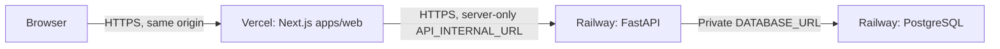

# Public demo deployment

AegisGraph is hosted at [aegisgraph.farhan-shafee.com](https://aegisgraph.farhan-shafee.com).
The current architecture is Browser → Vercel Next.js → Railway FastAPI → Railway
PostgreSQL. Both application services use `APP_MODE=public_demo`: synthetic data,
read-only investigation, curated deterministic analyst questions, and ephemeral
answers. The public analyst requires no OpenAI key and incurs no OpenAI spend.

This runbook describes the required configuration and operating procedures.
Hosting-dashboard settings, backups, billing limits, and platform logs must be
checked by the operator; the public URL alone does not verify those settings.
[PUBLIC_DEMO_VALIDATION.md](PUBLIC_DEMO_VALIDATION.md) is the historical
**2026-09-17 preparation record**, when local validation was complete and hosting
had not yet been performed. Its dated statements do not describe current hosting
status.



Only synthetic fintech telemetry belongs in this deployment. It is an engineering
demonstration, not a production SOC service. There is no public login or case-level
authorization. The entire initialized synthetic case is intentionally readable.

## Modes and boundaries

`APP_MODE=local` is the default and retains the interview workflow: annotations,
findings, report approval, deterministic analysis, and optional OpenAI analysis.
Use the [local setup](SETUP.md) for that workflow. Never publish the local mode.

Set **`APP_MODE=public_demo` on both services**. The backend:

- Requires an explicit PostgreSQL URL; SQLite is rejected. Local `.env` loading is
  skipped. Nothing needs an OpenAI key.
- Denies all non-read methods except the bounded analyst POST and CORS preflight.
  This includes incident edits/assignment, evidence changes/deletion, findings,
  notes, reports/approvals, evaluation reruns, detections, and unknown future write
  paths. There is no web seed/reset/admin endpoint. Denials return intentional 403s.
- Forces the deterministic provider even if `AI_PROVIDER=openai` was mistakenly
  supplied. Analyst answers and audit entries are **not persisted** in this mode.
- Accepts only `What most likely happened?` and `What malware family was used?`.
  The first returns validated evidence-grounded claims; the second demonstrates
  insufficient evidence. This is not a model-backed public interaction. The
  separately recorded [OpenAI validation](evaluations/LIVE_VALIDATION.md) remains
  available, with its measured scope and limitations.

The frontend checks the backend's public/read-only/deterministic runtime contract
before serving application data. A mismatched local backend fails closed. Its
same-origin `/api` proxy adds a second write boundary; the backend remains the
authoritative boundary for direct requests. Proxy calls forward the browser's
actual Origin, not a fabricated trusted Origin, and do not forward cookies,
Authorization, or client-supplied forwarding headers.

Dashboard, telemetry, detections, alerts, incident/correlation, timeline, evidence
inspection, entity relationships, evaluations, and architecture remain available.
Controls that save or approve work are absent in public mode. Reports remain a
local review workflow.

## Environment configuration

Maintain these values in the hosting dashboards. The table specifies required
configuration, not an export of verified dashboard settings. API-host placeholders
below are not usable configuration and contain no secrets. Do not upload a
workstation `.env`.

| Service | Variable | Value or source |
|---|---|---|
| Railway API | `APP_MODE` | `public_demo` |
| Railway API | `AEGISGRAPH_LOAD_ENV` | `false` |
| Railway API | `DATABASE_URL` | Reference the Railway PostgreSQL service's private `DATABASE_URL` |
| Railway API | `AI_PROVIDER` | `deterministic` (also enforced by public mode) |
| Railway API | `ALLOWED_ORIGINS` | Exact hosted frontend origin: `https://aegisgraph.farhan-shafee.com` |
| Railway API | `ALLOWED_HOSTS` | Exact API hostname and `healthcheck.railway.app`, comma separated |
| Railway API | `PORT` | Supplied by Railway; do not hard-code 8000 |
| Vercel web | `APP_MODE` | `public_demo`, at build and runtime |
| Vercel web | `API_INTERNAL_URL` | API HTTPS origin, e.g. `https://api.example.com` |

The standard Railway `postgresql://` URL is normalized to the installed psycopg 3
driver. Do not put database credentials in Vercel. Supply neither `OPENAI_API_KEY`
nor `OPENAI_MODEL` to either public service. No `NEXT_PUBLIC_*` variable is needed:
the browser calls its own `/api` routes, and the API origin stays server-side.
`ALLOW_REMOTE_DEMO` is a local-only escape hatch, not the public deployment mode.

Origins must use HTTPS and contain no path, trailing slash, credentials, query,
fragment, or wildcard. Hosts contain hostnames/IPs only, without schemes or ports.
Use the single stable Vercel production/custom domain. Add another exact trusted
origin only when intentionally supporting it; wildcard preview origins are not
supported. CORS does not provide authentication or prevent direct scripted reads.
Explicit HTTPS loopback origins/ports are accepted for local rehearsal only.

## Railway service

Use the repository root as the Docker build context. The root [Dockerfile](../Dockerfile)
contains the Python API, migrations, detection rules, and synthetic evaluation
fixtures; an allowlist [.dockerignore](../.dockerignore) excludes configuration,
databases, frontend artifacts, and local runtime files. It runs as a non-root user.

Railway [detects the root Dockerfile](https://docs.railway.com/builds/dockerfiles).
No new `railway.toml` is included because Railway's
[Config as Code documentation](https://docs.railway.com/config-as-code/reference)
now marks that mechanism deprecated. Configure these service settings directly:

| Setting | Value |
|---|---|
| Root directory / build context | Repository root |
| Builder | Dockerfile |
| Start command | Image CMD, or `python -m aegisgraph.cli public-serve` |
| Pre-deploy command, first initialization only | `python -m aegisgraph.cli public-init --seed` |
| Pre-deploy command, subsequent deployments | `python -m aegisgraph.cli public-init` |
| Healthcheck path | `/ready` |
| Healthcheck timeout | 120 seconds |
| Replicas / regions | One replica in one region |

`public-serve` requires Railway's `PORT`, binds `0.0.0.0`, and runs one worker.
It disables Uvicorn access logs and forwarded-IP trust. Hosting terminates HTTPS.
It performs **no migration, seed, or reset at startup**.

`/health` returns minimal database-connectivity status. `/ready` additionally
checks the synthetic fixture and saved deterministic evaluation; incomplete data
returns 503. Railway uses `healthcheck.railway.app` for its probe Host header, so
that exact host must be allowed. Railway's
[health check](https://docs.railway.com/deployments/healthchecks) gates deployment
activation; it is not continuous uptime monitoring.

## Database initialization

For a new or intentionally replaced deployment, use a **fresh, dedicated
PostgreSQL database**, not an interview database with saved analyst work. Do not
import customer data or local live-provider artifacts. The existing hosted
database does not need reseeding for ordinary application updates.

```sh
# Run in the configured Railway API deployment/admin environment.
python -m aegisgraph.cli public-init --seed
python -m aegisgraph.cli public-check
```

The init command takes a PostgreSQL advisory lock, runs `alembic upgrade head`, and
seeds only when `--seed` was explicitly supplied. The canonical seed has 4,026
events, 10 alerts, one incident (`INC-fe8fa4b9508c`), 26 case evidence items, and
235 entities across all telemetry (36 appear in the flagship case). It saves one
deterministic evaluation run. A complete existing public dataset is left unchanged.
Incomplete or edited data is refused rather than erased; a canonical seed whose
evaluation step was interrupted can finish that step. These checks establish
fixture presence, not cryptographic evidence integrity.

`public-init` without `--seed` migrates and checks readiness; an empty/incomplete
database exits nonzero. This is the normal later pre-deploy command. `public-check`
is read-only and exits nonzero when the dataset is not ready. CLI errors omit
connection details. All local seed/reset/evaluation/serve commands are refused in
public mode. Destructive recovery belongs to a deliberate hosting/database-admin
workflow with a backup or a fresh replacement database; there is no automatic reset.

## Vercel project

The hosted frontend is a separate **Next.js** project. Use these settings when
maintaining it or creating a replacement project:

| Setting | Value |
|---|---|
| Root Directory | `apps/web` |
| Framework preset | Next.js |
| Node.js | 24.x |
| Install command | `npm ci` |
| Build command | `npm run build` |
| Output directory | Next.js default; do not set `out` |
| Environment | `APP_MODE=public_demo`, `API_INTERNAL_URL=https://<actual-api-host>` |

The web package has its own lockfile and needs no Python backend or external
workspace package in its Vercel build. FastAPI remains exclusively on Railway.
Keep preview deployments protected unless their exact origins are deliberately
allowed on a separate backend. Vercel
[environment changes apply to new deployments](https://vercel.com/docs/environment-variables),
so rebuild/redeploy after changing the mode or API origin.

## Limits and remaining risks

The API uses fixed-size, process-wide token buckets; it does not trust spoofable
forwarded IPs or allocate a limiter entry per visitor. Current budgets are:

| Work | Sustained budget / burst |
|---|---|
| All requests combined | 300/minute / 100 |
| Reads | 240/minute / 60 |
| Event search | 60/minute / 20 |
| Analyst | 12/minute / 4 |
| Health/readiness | 60/minute / 10 |

There are at most eight in-flight API requests, including at most two analyst
requests. A public request body is capped at 8 KiB with a five-second read timeout;
path, query, and header sizes are bounded. Pagination is bounded. Throttled calls
return 429 with retry guidance. The Next proxy also bounds input and upstream time.
Public docs/OpenAPI endpoints are disabled. Public validation/error responses do
not echo inputs, and application request logs omit paths, headers, and payloads.

These are small-demo resource bounds, not DDoS protection or per-user fairness.
Visitors share the budget, restarts reset it, and additional workers/replicas would
multiply it. One visitor can temporarily deny another capacity. Deployment overlap
can briefly run two processes. Add hosting edge controls and coordinated limits
before scaling. Review hosting log retention, traffic limits, budget alerts, and
database backups in the dashboards; application controls do not govern platform
logs or hosting charges. No public OpenAI spend is possible through the implemented
analyst path, but ordinary hosting/database costs still apply.

## Updating the existing deployment

Keep the existing Vercel frontend, Railway API, and Railway PostgreSQL services.
Before an update, review the commit, CI results, migrations, and compatibility with
the currently hosted dataset. Retain the last known-good deployments and verify
the operator's database recovery plan. Keep public mode and exact origins/hosts
throughout the rollout; no OpenAI credentials are required.

The normal API pre-deploy command is `python -m aegisgraph.cli public-init`, without
`--seed`. Require `/ready` and the hosted checks below to pass before treating the
update as complete. Check the actual platform deployment results separately from
local and CI validation. Do not reset, reseed, or recreate the hosted database to
work around a failed migration or readiness check.

## Initial deployment or deliberate replacement

The following sequence documents reproducible setup of a new deployment. It does
not imply that the current hosted services still need to be created.

1. Review the commit, passing CI, [validation record](PUBLIC_DEMO_VALIDATION.md),
   and host billing/limits. No repository visibility change is required.
2. Create Railway PostgreSQL and an API service from this repository. Configure
   the Dockerfile settings and variables above before enabling a deployment.
   Reserve the API hostname and the intended stable Vercel frontend hostname.
3. Set the first pre-deploy command to `public-init --seed` with the full Python
   invocation above. Deploy the API manually. Require `/ready` to pass before
   continuing; run `public-check` in the service's admin execution environment if
   additional verification is needed. Do not publish an uninitialized service.
4. Change the saved pre-deploy command to `python -m aegisgraph.cli public-init`
   for subsequent deployments. Do not put `--seed` or reset commands in startup.
5. Create/configure the Vercel project with the exact settings above and deploy it
   manually. Confirm its final HTTPS origin exactly matches `ALLOWED_ORIGINS`;
   apply a backend configuration deployment if the chosen domain differs.
6. On the hosted site, inspect all eight routes, the flagship's source evidence,
   both curated analyst answers, and evaluation counts. Verify persistent controls
   are absent, a harmless incident PATCH returns 403, and an analyst request from
   an untrusted Origin returns 403. Confirm public docs return 404.
7. Check host logs for generic failures, confirm database rows remain unchanged by
   those interactions, and configure monitoring/budget alerts before sharing the URL.

## Rollback

Keep the last known-good API image, Vercel deployment, and environment settings.
Roll back both services to a version that supports `public_demo`; **never roll a
public endpoint back to a writable local-only version**. Keep the same read-only
mode and exact origin/host settings. Review schema compatibility for each release
before rolling application code back to an older image.
Do not automatically run Alembic downgrade or seed/reset during rollback. For an
incompatible schema or damaged fixture, stop public traffic, restore a verified
backup or initialize a fresh replacement database intentionally, then rerun
`public-check` and the hosted smoke steps before restoring access.

## Local public-mode rehearsal

CI runs [validate_public_database.py](../scripts/validate_public_database.py) against
a clean PostgreSQL service and checks that reinitialization/public requests leave
an identical database snapshot. After that initialization, build the web app with
public-mode settings and run:

```sh
node apps/web/node_modules/@playwright/test/cli.js test --config playwright.public.config.ts
```

Supply the dedicated database URL in the environment. The test runner starts only
loopback services and generates temporary HTTPS certificates under ignored
`.runtime/public-tls`; OpenSSL is required. It trusts that test certificate only
in the child Node process and browser test context. It never disables server TLS
verification globally. This tests production Next.js behavior and the API over
HTTPS locally, not Vercel/Railway infrastructure, certificates, or networking.
