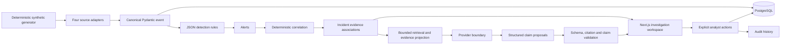
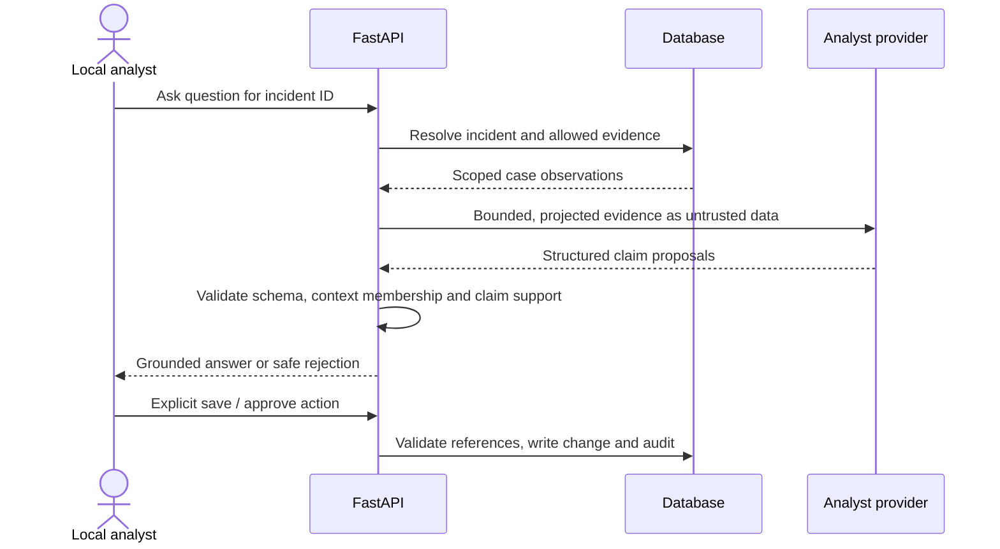
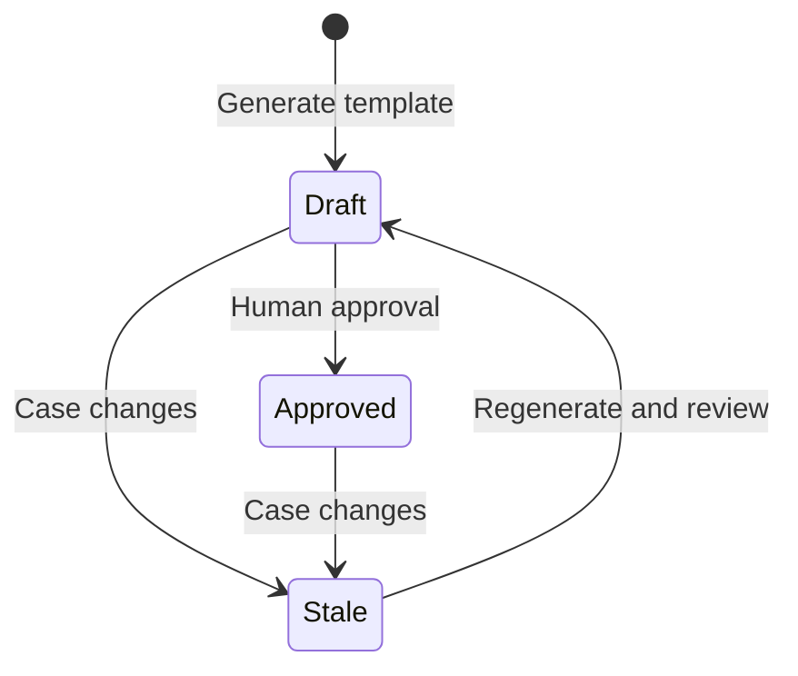

# System architecture

AegisGraph investigates a fictional Atlas Trading Platform environment. It is a
single API, one web application, and one relational database. It does not monitor
real infrastructure, execute responses, or connect to financial institutions.

The explicit analyst write path describes local/interview mode. In
`APP_MODE=public_demo`, the same investigation data is explorable, but persistent
API writes are denied and the two curated deterministic answers are not saved.

## Ingestion and detection

Identity, API gateway, endpoint, and Atlas application adapters translate source
payloads to the same event vocabulary. The default generator produces 4,000
ordinary events and 26 scenario observations. Default rules derive 10 alerts and
one incident containing 26 evidence rows. These are fixture counts, not quality
or performance measurements. IP addresses use documentation ranges, account
identifiers are fictional, and location labels are simulation indicators.

Canonical event IDs identify immutable observations. An analyst changes the
case's relevance annotation, not the source event. No event edit or delete route
is available. ORM hooks block source-event update/delete, and Alembic installs
PostgreSQL/SQLite triggers rejecting ordinary updates and deletes for both events
and audit records. These guarantees apply to migrated tables. A database owner
can remove triggers, change schema, or use the explicit reset command; the design
does not claim privileged-owner resistance or cryptographic evidence integrity.
Production would add restricted database roles and independent retained copies.

Detection rules describe suspicious signals and temporal sequences. They produce
alerts containing evidence references. Correlation subsequently assembles related
alerts and context into an incident. A detection is neither a verdict of compromise
nor an incident by itself. Thresholds are inspectable in the rules and have explicit
units and windows; severity does not come from an unexplained numerical score.

Correlation groups alerts by principal and parsed event time. A cluster spans at
most 30 minutes from its first alert and becomes an incident only if it contains
at least three distinct rules across at least two rule-ID families. Session,
device, and IP links are context, not grouping predicates. Some detection rules,
such as MFA or privilege following unfamiliar authentication, separately require
the same session. The resulting case includes the principal's observations from
five minutes before its first alert through its last alert, plus alert-cited
events needed to explain the detections. Correlation can therefore include benign
context or older baseline evidence. Generic rule mixes receive a generic summary;
the flagship account-compromise hypothesis is conditional on its auth, privilege,
and sensitive-access rule mix.

The incident API exposes these facts under `correlation`: observed principal IDs,
linked alert count, distinct rule IDs and families, first/last alert timestamps,
measured span, and the shared configured window/minimum thresholds. The primary
fixture has ten alerts from nine distinct rules across five families, spanning
22 minutes. `grouping_keys` identifies principal and event time, while
`context_only` names device/session/IP. The workspace renders these derived facts
rather than inventing an explanation from a model or graph appearance.

Incident severity is an explicit V1 policy: high when the cluster contains both
IAM and APP families, otherwise medium. It is not a learned risk score or a
calibrated estimate of impact.

## Relational evidence and graph

Events, alerts, incidents, incident evidence, findings, entity links, analyses,
reports, and audit records live in SQLAlchemy models with Alembic migrations.
The entity graph is a view over relational links, with evidence IDs on edges.
An IP/device/session shared in a case is a relationship, not proof of attribution.
Timeline order comes from event time. Processing/audit time is recorded separately.

The browser fetches paginated events and case detail capped at 500 evidence rows.
The derived incident graph uses that same bounded detail set. Indexed timestamps,
identities, sessions, event types, and association keys support V1 queries.
SQLite is a convenience for local execution and isolated tests. PostgreSQL is the
intended persisted database and the database used by the CI integration job.

## Analyst trust boundaries

The provider interface receives no database connection, application write
credentials, shell, retrieval tools, or incident mutation functions. The optional
OpenAI transport holds only the key needed to call the fixed provider endpoint;
the model itself receives no key or execution tools. Citation validity alone is too weak:
an existing event ID does not make arbitrary prose true. Claim types are validated
against the cited event fields, then rendered through server templates. This
limits expressiveness deliberately. The summary is derived from the same accepted
findings and cites their evidence. Arbitrary model-written prose is not admitted
to factual output. Uncertain interpretation remains labeled as a hypothesis.

The service retrieves the first 50 case evidence rows ordered by event time and
ID. The analyst boundary validates incident membership, unique IDs, and a separate
80-row cap, then excludes analyst-benign rows. The resulting answer reports both
the included count and benign-exclusion count. No replacement rows are retrieved
after that exclusion. The serialized projected context is limited to 64,000 UTF-8
bytes; questions are limited to 2,000 characters. This is bounded selection, not a
claim that every event in a larger incident reaches the provider.

Questions and all telemetry content are untrusted. Source text is never promoted
to system instructions. The live provider uses structured responses and the same
post-validation as the deterministic provider. Its prompt is defense in depth;
the deterministic output boundary carries the stronger enforcement.

Common false-premise questions use a conservative phrase guard. It identifies
missing malware, transfer, personal-data-field, identity, or location evidence.
The guard is not a general natural-language entailment test. Independent claim
validation still prevents novel question wording from adding arbitrary facts.

## Reports and human review

Reports are deterministic templates assembled from case evidence, entities,
status, and approved analyst findings. They are not model-written narratives.
Creating or approving a finding is a separate human API action; the provider
cannot invoke it. Report generation creates a draft. Case edits, evidence
annotations, findings, finding review, and notes invalidate an existing report,
clear approval metadata, and append a `report_invalidated` audit entry when its
status first changes to stale. Stale approval returns a conflict until the analyst
regenerates and reviews the report. Only the current report is stored; audit
records record lifecycle actions rather than complete historical report versions.

## Deployment boundary

The local browser communicates with the Next.js server, which proxies `/api` to
the loopback FastAPI service. Both local development servers and Docker's PostgreSQL
port should remain bound to loopback. There is one fixed local analyst; there is
no login screen or claim of multi-user access control. Case-scoped evidence
validation is implemented, but all cases are accessible to that local analyst;
it is not user or tenant authorization. The API also checks trusted host names,
local client addresses by default, and mutation origins when an Origin header is
present. Those transport checks do not establish a human identity. A shared
writable service requires identity, case entitlements, CSRF/session controls,
restricted database roles, secret management, and independent audit retention.

The [hosted public demo](https://aegisgraph.farhan-shafee.com) follows
Browser → Vercel Next.js → Railway FastAPI → Railway PostgreSQL.
Both application services explicitly select `APP_MODE=public_demo`;
the frontend requires an HTTPS `API_INTERNAL_URL` and verifies that the backend
advertises the same read-only, deterministic contract. No backend address or
credential is passed to client components. The proxy preserves the actual
browser Origin for backend allowlist validation and does not forward browser
authorization headers or cookies. Public mode never falls back to SQLite or a
live model provider. All API writes are denied except the two curated,
non-persistent analysis requests. Source inspection and saved results remain
available. Exact host/origin configuration, request limits, safe errors, and
shared process budgets bound this intentionally small public surface. These are
demo controls, not production authentication or an availability guarantee. The
public analyst requires no OpenAI key and incurs no OpenAI spend.
See the current [deployment runbook](../DEPLOYMENT.md) for operating requirements.
The [September 17 preparation record](../PUBLIC_DEMO_VALIDATION.md) preserves the
earlier local validation evidence; it is not a statement of current hosting status
or independent verification of hosting-dashboard settings.

The optional model provider is a separate data boundary. Only synthetic bounded
case context is sent; provider retention, data residency, and organizational
approval must be resolved before any future real-data use.

Local configuration loads the repository-root `.env` once without overriding
explicit process variables. Public mode skips that file and uses process
environment configuration. Variable interpolation is disabled locally. Set
`AEGISGRAPH_LOAD_ENV=false` to disable file loading. Provider keys remain in the
server environment, never in serialized settings or health responses. Tests
disable workstation `.env` loading and use deterministic mode. These are local
configuration conveniences, not managed secrets or production identity controls.

## Reproducible disposable demo

`python -m aegisgraph.cli demo-reset` ignores the configured `DATABASE_URL` and
rebuilds only `.runtime/aegisgraph-demo.db`. The sequence drops/reapplies migrations,
seeds canonical events, evaluates detections, creates the correlated incident,
then executes and records deterministic evaluations. `demo-api` selects the same
reserved database and binds to loopback; its provider defaults to deterministic,
with OpenAI available only through explicit `--provider openai`.

Both commands accept `--postgres-port PORT` for a pre-created loopback PostgreSQL
database named exactly `aegisgraph_demo`, owned by the local `aegisgraph` demo role.
The database name, host and role are fixed; arbitrary database URLs are not accepted.
Legacy `seed --reset` is likewise limited to that PostgreSQL target or the two
reserved `.runtime` SQLite files used for demo and browser tests. SQLite symlinks,
directory redirection and hard-linked database files are rejected. Direct
database-owner tools can still bypass these accidental-reset protections.

`demo-health` performs read-only HTTP checks of the loopback API/database and
expected scenario counts, verifies fixture availability, and invokes an explicit
deterministic provider in process. It never calls an external provider. It checks
demo readiness, not production availability or source authenticity.

## Operational limits

Ingestion and correlation are synchronous for a bounded demonstration dataset.
There is no streaming ingestion, durable task queue, distributed rule scheduler,
or exactly-once event transport. Request IDs and structured request logs support
local diagnosis. Application logs omit telemetry bodies, model prompts, raw model
answers, and API keys. No HTTP ingestion, reset, arbitrary command, or file-upload
endpoint is exposed; the seed pipeline runs through the local CLI.
Public deployment initialization is also an explicit administrator CLI workflow:
migrate, inspect, and seed only when requested. API startup never reseeds data.
Evaluation records identify the provider and actual cases executed; deterministic
boundary tests do not establish live-model prompt-injection resistance.
`GET /api/evaluations` selects deterministic records, and
`GET /api/evaluations/live` separately returns the latest recorded OpenAI run or
an explicit not-run state. Neither read endpoint performs evaluation calls. Live
results label external calls separately from application-boundary checks; only
the opt-in live evaluation runner can initiate those measured calls.
