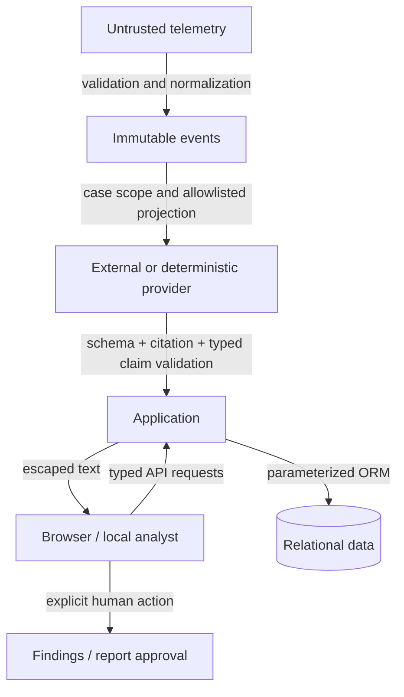

# AegisGraph V1 threat model

## Scope and assumptions

This model covers the local synthetic-data demo. The trusted operator owns the
machine and database. API and web servers bind to loopback. A fixed local analyst
is not authentication. Internet exposure, hostile local users, production data,
and multi-tenant access require controls beyond this release.

## Assets

- Integrity and provenance of canonical events and evidence associations.
- Incident state, analyst findings, annotations, and human report approvals.
- Separation between a current case and unrelated incident evidence.
- Model-provider credentials and any context sent to the provider.
- Audit history and truthful evaluation results.
- Availability of the API, database, and analyst workspace.

## Actors and entry points

The analyst uses the browser and documented API. A simulated adversary controls
telemetry strings, including process metadata and user agents. A model may emit
malformed, unsupported, or malicious output. A malicious web origin may attempt
requests against local services. A repository contributor can alter code, rules,
fixtures, or dependencies. The database owner and machine administrator remain
trusted in V1.

Entry points are API request bodies and query parameters, normalized source
payloads, model responses, process environment and the ignored root `.env` file, database content, and dependency
installation. Ingestion is a local generator/adapter/CLI path; there is no public
telemetry ingestion, reset, arbitrary file-upload, or command-execution API.

## Trust boundaries

## Threats, mitigations, and residual risk

| Threat | Implemented defense | Residual risk / production requirement |
|---|---|---|
| Telemetry injection | Typed canonical schema, bounded fields, JSON serialization; no `eval`, shell, or SQL string execution of events | A well-formed observation may still be false; add authenticated source ingestion and provenance |
| Prompt injection in logs or metadata | Untrusted data boundary, allowlisted projection, no tools, structured proposals, deterministic claim checks | A model can choose an incomplete or misleading subset of supported facts; human review and live-provider adversarial evaluation remain necessary |
| Evidence tampering | No source-event mutation route; separate case annotations; ORM edit/delete guards; migrated PostgreSQL/SQLite triggers reject ordinary event UPDATE/DELETE | A database owner can remove triggers or change schema; add restricted roles, independent retention and backup verification |
| Cross-case leakage | Evidence retrieved by current incident, bounded context IDs independently checked; finding/report evidence validation | Fixed demo identity is not user/tenant authorization; add row-level tenant scope and case entitlements |
| Authorization bypass | No authorization decisions delegated to AI; human write routes separated from provider interface | Anyone with local API access acts as the demo analyst; identity and session enforcement are required before exposure |
| Malicious upload | No file upload feature; bounded JSON inputs and source adapters | Real ingestion needs decompression limits, quotas, source credentials and schema version controls |
| Hallucination / citation laundering | Strict structured claim types, exact support sets, deterministic findings and cited summary; one invalid claim rejects the whole answer | Source facts or predicates can be wrong; supported selections can be incomplete; the phrase-based false-premise guard is not a general entailment classifier |
| Benign activity supporting suspicion | Analyst-benign evidence is excluded before provider context and claim selection; result discloses exclusions | The initial correlation may include benign context, annotations can be wrong, and the remaining bounded selection can omit useful alternative explanations |
| Secrets exposure | Ignored root `.env` loads without overriding explicit process values or interpolating variables; configuration diagnostics never include secret values; database URL excluded from settings repr; deterministic demo children remove provider key/model variables; tests disable workstation `.env` loading; no full prompts in logs | Machine/environment compromise remains possible; `.env` is trusted local configuration, not a secret vault; add managed secrets and rotation |
| Unsafe tool execution | Provider interface has no tools or mutation handles | Future tools would require separate design and approval; do not infer safety from prompting |
| Audit log alteration | Application audits workflow actions; no audit edit API; migrated DB triggers reject ordinary audit UPDATE/DELETE; human/system labels distinguished | Labels are not authenticated identities; privileged owners can remove triggers; logs are not cryptographically immutable or externally retained |
| Report manipulation or stale approval | Deterministic template uses scoped evidence and approved findings; case changes mark it stale, clear approval metadata, and block approval until regeneration | Human-approved narratives are not semantically verified; only the current report is stored, and external copies do not update when the case changes |
| XSS | React text escaping, no untrusted HTML rendering, security response headers | CSP/runtime configuration and dependencies still require review; no sanitizer makes arbitrary HTML inherently safe |
| SQL injection | SQLAlchemy bound values and typed/filter-limited request parameters | Raw SQL added later needs separate review; least-privilege DB accounts remain future work |
| CSRF / hostile web origin | Loopback defaults, trusted-host checks, local-client restriction, explicit mutation-origin allowlist when Origin is present, and restricted CORS | Requests without Origin may be accepted locally; these are not authenticated sessions or complete shared-deployment CSRF controls |
| Resource exhaustion | Paginated events, case detail capped at 500 evidence rows, first 50 rows retrieved for AI, separate 80-row/64,000-byte analyst cap, 1 MiB HTTP body limit, bounded provider response and timeout | No production rate limiting or per-user quotas; synchronous requests and model cost can exhaust resources; bounded retrieval can omit evidence |
| Dependency compromise | Lockfiles, audit commands, CI checks and versioned migrations | Audits detect known advisories only; they do not establish supply-chain integrity |
| Accidental destructive reset | `demo-reset` ignores `DATABASE_URL` and selects only a reserved SQLite file or fixed loopback PostgreSQL database named `aegisgraph_demo`; legacy reset is also guarded; SQLite links/hard links and PostgreSQL URL query overrides are rejected | Reset intentionally removes annotations, findings, audits and evaluations in that disposable target; direct database-owner tools can bypass the CLI, and filesystem checks are not race-proof against hostile local users |
| Evaluation provenance confusion | Deterministic and live-provider records are read through separate API endpoints; the live endpoint only reads recorded runs; live execution requires a separately invoked opt-in runner | A trusted DB owner can fabricate records; measured live samples do not establish a population-level resistance or accuracy rate |

## Abuse-focused validation

The backend and AI suites cover malformed responses, unknown evidence IDs,
cross-case and out-of-context references, unsupported typed claims, false premises,
untrusted telemetry strings, temporal detection boundaries, and model mutation
isolation. The UI shows only outcomes from executed evaluation cases. See
[evaluation methodology](../evaluations/README.md) and the [validation record](../VALIDATION.md)
for the exact checked scope and execution limitations.

Database-trigger guarantees require applying Alembic migrations. Model-only tests
that create tables directly are not evidence that the triggers are installed.
The guarded demo reset deliberately drops and recreates application tables and
their triggers only in its reserved disposable target. It runs migrations, seed,
detections, correlation and deterministic evaluations. The default demo server is
deterministic even when the local `.env` selects a live provider; external calls
require `demo-api --provider openai`. The health command accepts only a plain
loopback HTTP URL, does not inherit proxy settings, and uses an explicit
deterministic provider without transmitting context externally.

Correlation explanations are derived from linked alert records and shared rule
constants. They expose actual principal/rule/family counts and measured alert
span. Device/session/IP relationships are explicitly investigation context, not
additional grouping predicates or evidence of real-world actor attribution.

## Production gates

Before any real deployment: authenticated identities and case permissions,
tenant-aware storage, CSRF/session controls, TLS, rate and ingestion limits,
separate DB roles, immutable external audit storage, retention/deletion policy,
provider privacy review, operational recovery exercises, adversarial live-model
evaluation, and independent security assessment. No compliance certification,
bank integration, autonomous containment, or enterprise authorization is claimed.
